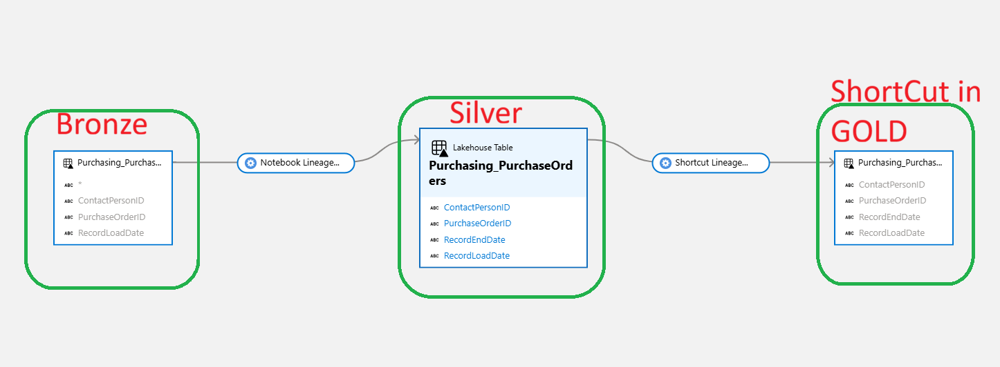

# NB_FABRIC_PURVIEW_LINEAGE_TABLE_COLUMN_EXTRACTOR

## Overview

This notebook extracts **table and column-level lineage** from Microsoft Fabric Lakehouses and registers it in **Microsoft Purview**. It enables data governance and lineage tracking at the column level, allowing organizations to understand data flow and transformations across Fabric workspaces.


## Purpose

The notebook performs the following key functions:

1. **Discovers metadata** from source and target Lakehouses in Microsoft Fabric
2. **Extracts column information** including schema, table name, column name, and data type
3. **Maps columns** between source and target tables to establish lineage relationships
4. **Registers lineage in Purview** with column-level mappings for comprehensive data governance
5. **Handles unmatched columns** by marking them with an asterisk (*) in Purview

## Prerequisites

### 1. Service Principal (App Registration)
A dedicated service principal is required to authenticate against both Microsoft Fabric and Microsoft Purview.

**Setup Steps:**
- Create a service principal in Azure Active Directory (App Registration)
- Store credentials in Azure Key Vault with the following secret names:
  - `tenant_id`
  - `client_id` (App ID)
  - `client_secret`

### 2.Enable access in the Fabric Admin portal

Sign in to the Fabric admin portal. You need to be a Fabric admin to see the tenant settings page.
Make sure the following settings are enabled:

**Admin API settings:**
- Service principals can access read-only admin APIs
- Service principals can access admin APIs used for update

> [!NOTE]
> In case you need to use a **security group**, add the security group to the settings above.
> Add Workspace identity (after deployment) or Service Principal to the security groups.

### 3. Microsoft Fabric Workspace Access
The service principal must be added to **each Fabric workspace** containing the source and target Lakehouses.

**Action:**
- Navigate to each Fabric workspace → **Manage access** → Add the service principal as **Viewer**

### 4. Microsoft Purview Role Assignment
The service principal requires one of the following roles in Microsoft Purview:

- **Data Curator** — grants read/write access to data assets and lineage
- **Data Source Admin** — grants full control over data source registration and scanning

**Action:**
- Navigate to **Microsoft Purview** → **Data Map** → **Collections** → select your collection → **Role assignments** → add the service principal to the desired role

### 5. Network Connectivity
- Access to the Fabric Lakehouse SQL endpoints
- Access to the Purview REST API

## Configuration Parameters

Configure the following parameters in the notebook before running:

| Parameter | Description | 
|-----------|-------------|
| `SourceWorkspaceName` | Display name of the source workspace |
| `TargetWorkspaceName` | Display name of the target workspace |
| `SourceLakehouseName` | Name of the source Lakehouse |
| `TargetLakehouseName` | Name of the target Lakehouse |
| `SourceWorkspace` | Workspace ID (GUID) |
| `TargetWorkspace` | Workspace ID (GUID) |
| `SourceLakehouse` | Lakehouse ID (GUID) |
| `TargetLakehouse` | Lakehouse ID (GUID) |
| `filter` | Optional table name filter (leave empty for all) |
| `tenant_id` | Key Vault secret name for tenant ID |
| `client_id` | Key Vault secret name for client ID |
| `key_vault` | Azure Key Vault name |
| `secret_name` | Key Vault secret name for client secret |
| `PurviewAccount_name` | Purview account name |
| `sourceschema_is_targetschema` | If `True`, matches by schema + table name (more reliable). If `False`, matches by table name only |
| `processtype` | Type of process for Purview 'Shortcut' 'Notebook' MLV |

## How It Works

### Step 1: Authentication
- Retrieves service principal credentials from Azure Key Vault
- Establishes connections to:
  - Fabric Workspaces (for metadata extraction)
  - Purview (for lineage registration)
  - Lakehouse SQL endpoints (for table/column metadata)

### Step 2: Metadata Discovery
- Queries Lakehouse system tables (`sys.tables`, `sys.columns`, `sys.schemas`, `sys.types`)
- Collects information about:
  - Table schemas and names
  - Column names and data types
  - Column IDs

### Step 3: Column Mapping
- Performs a **full outer join** between source and target columns
- Matches columns by:
  - Table name (and optionally table schema, if `sourceschema_is_targetschema=True`)
  - Column name
- Marks unmatched columns with `*` for visibility

### Step 4: Lineage Registration
- Creates/updates Purview entities for source and target tables
- Establishes **Process entities** that link source columns to target columns
- Includes custom attributes such as:
  - `columnMapping`: Column-level mappings
  - `schedule`: Execution schedule
  - `dataLayer`: Data layer classification

### Step 5: Output
- Displays all discovered columns and their mappings
- Logs successful and failed lineage registrations to Purview

## Key Remarks

- **Table names must match** between source and target (case-insensitive)
- **Table schema is optional** but more reliable for matching when enabled
- **Unmatched columns** are marked with a `*` in Purview for easy identification
- **Full outer join** ensures visibility of:
  - Columns present only in source (potential data loss)
  - Columns present only in target (potential missing sources)
  - Columns present in both (properly mapped)

## Dependencies

The notebook requires the following libraries:

- `pyapacheatlas` — Apache Atlas Python client for Purview by Will Johnson et al. https://github.com/wjohnson/pyapacheatlas
- `pyodbc` — ODBC driver for SQL connections
- `azure-identity` — Azure authentication
- `requests` — HTTP client for Fabric API calls
- `pyspark.sql` — Spark SQL functionality

These are automatically installed at runtime.

## Error Handling

The notebook includes error handling for:

- **Connection failures** to Lakehouses or Purview
- **Missing credentials** in Key Vault
- **Insufficient permissions** (service principal roles)
- **Missing tables** or columns in source/target
- **Network timeouts** (12-second timeout for connections)

## Common Issues & Troubleshooting

| Issue | Cause | Solution |
|-------|-------|----------|
| Authentication fails | Invalid credentials in Key Vault | Verify tenant ID, client ID, and secret are correct and accessible |
| Cannot connect to Lakehouse | Service principal lacks Viewer access | Add service principal as Viewer to the workspace |
| Lineage not appearing in Purview | Service principal lacks Data Curator/Admin role | Assign proper role in Purview Collections |
| No columns found | Filter parameter is incorrect or no tables exist | Remove filter or verify table exists in Lakehouse |
| Connection timeout | Network or service issue | Check network connectivity and increase timeout if needed |

## Usage Example

```python
# Update configuration
SourceWorkspaceName = 'INTEGRATION DATA (D)'
TargetWorkspaceName = 'INTEGRATION DATA (D)'
SourceLakehouseName = 'LH_BRONZE_LAYER'
TargetLakehouseName = 'LH_SILVER_LAYER'
SourceWorkspace = '00000000-0000-0000-0000-000000000000'
TargetWorkspace = '00000000-0000-0000-0000-000000000000'
SourceLakehouse = '00000000-0000-0000-0000-000000000000'
TargetLakehouse = '00000000-0000-0000-0000-000000000000'
filter = ''  # Process all tables

# Run all cells in order
# Monitor output for:
# - ✅ Successful column discovery
# - ⚠️  Warnings about unmatched columns
# - Lineage entities created/updated in Purview
```

## Security Best Practices

1. **Use Azure Key Vault** to store all credentials securely
2. **Rotate service principal secrets** regularly
3. **Apply principle of least privilege** — grant only necessary Purview roles
4. **Audit access** — monitor Purview lineage changes
5. **Never hardcode** credentials in the notebook
6. **Use workspace-scoped permissions** for source/target Lakehouses


## Support & Maintenance

For issues or enhancements:
- Check the Azure Key Vault secrets are correctly configured
- Verify service principal roles in Purview and Fabric
- Review notebook output logs for specific error messages
- Consult Microsoft Purview and Fabric documentation

---


